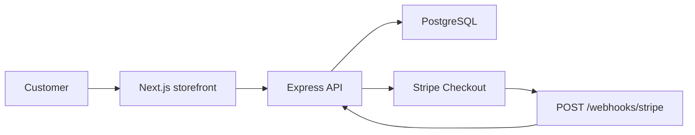

# Nordstrand Commerce

Headless e-commerce demo built to be **sellable to clients** and **hireable at larger companies** — one monorepo that shows storefront, API, database, payments, and tests.

**Live (coming soon):** storefront on Netlify · API on Render · PostgreSQL on Neon

## Why this project exists

| Audience | What they see |
|----------|----------------|
| **E-commerce clients** | Professional demo shop, Stripe checkout, product catalog |
| **Backend employers** | REST API, PostgreSQL, Prisma, webhooks, inventory rules, tests |
| **Fullstack roles** | Monorepo, typed contracts, separate deployable services |

This is the commerce flagship discussed in your portfolio strategy — not another marketing site, not the Nic Cage school demo.

## Architecture



### Monorepo layout

```text
nordstrand-commerce/
├── apps/
│   ├── api/     Express + Prisma + Stripe + Vitest
│   └── web/     Next.js storefront
├── packages/
│   └── shared/  Zod schemas + shared types
└── docker-compose.yml
```

## Stack

| Layer | Technology |
|-------|------------|
| Storefront | Next.js 15, React 19, TypeScript, Tailwind CSS 4 |
| API | Express 5, TypeScript, Zod validation |
| Database | PostgreSQL 16, Prisma ORM, Flyway-style migrations via Prisma |
| Payments | Stripe Checkout + webhooks |
| Tests | Vitest + Supertest |
| CI | GitHub Actions (Postgres service + test + build) |
| Local infra | Docker Compose |

## Core API

| Method | Path | Purpose |
|--------|------|---------|
| `GET` | `/health` | Health + database check |
| `GET` | `/api/v1/products` | List products |
| `GET` | `/api/v1/products/:slug` | Product detail |
| `POST` | `/api/v1/checkout/sessions` | Create order + Stripe session |
| `GET` | `/api/v1/checkout/orders/:id` | Order status |
| `POST` | `/api/v1/webhooks/stripe` | Payment confirmation |

### Commerce rules (backend)

1. Stock is validated server-side before checkout
2. Stock is decremented when a Stripe session is created
3. Stripe webhook marks order `PAID`
4. Expired sessions restore stock and cancel the order

## Getting started

### 1. Install

```bash
npm install
```

### 2. Environment

```bash
cp .env.example .env
# Add Stripe test keys from https://dashboard.stripe.com/test/apikeys
```

### 3. Database

```bash
npm run db:setup
```

### 4. Run locally

```bash
# Terminal 1 — API
npm run dev:api

# Terminal 2 — storefront
npm run dev:web
```

- Storefront: http://localhost:3000
- API: http://localhost:4000/health

### 5. Stripe webhooks (local)

```bash
stripe listen --forward-to localhost:4000/api/v1/webhooks/stripe
```

Copy the webhook signing secret into `.env` as `STRIPE_WEBHOOK_SECRET`.

## Tests

```bash
npm test
```

## Production path (next steps)

| Service | Target | Why |
|---------|--------|-----|
| `apps/web` | Netlify | Static/SSR storefront, free tier |
| `apps/api` | Render or Fly.io | Long-running Node API |
| PostgreSQL | Neon | Managed Postgres, free tier |
| Stripe | Test → Live | Real payment flow when demo is ready |

Optional later: Dockerize API and add Kubernetes manifests (reuse patterns from `reserve-flow`).

## Portfolio talking points

- **Why monorepo?** Shared types between API and web, one CI pipeline, mirrors real teams.
- **Why separate API?** Shows you can build services employers can deploy and scale independently.
- **Why Stripe webhooks?** Server-side payment confirmation — not fake checkout buttons.
- **Why stock on the server?** Clients and employers both care that commerce logic lives in the backend.

## Related projects

- [`nic-cage-snacks-shop`](https://github.com/Elli2022/nic-cage-snacks-shop) — early Firebase demo (origin story)
- [`reserve-flow`](https://github.com/Elli2022/reserve-flow) — Java/Spring Boot + Kubernetes backend showcase

## License

Private portfolio project.
