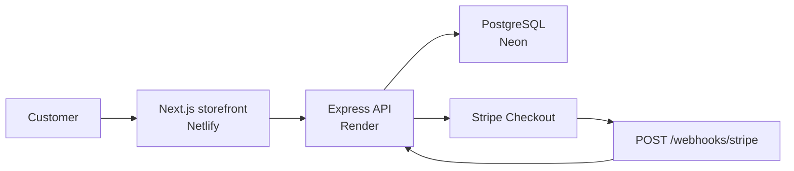

# Nordstrand Commerce

**Production-style headless e-commerce** — a full-stack monorepo with a live storefront, REST API, PostgreSQL database, and Stripe Checkout with webhooks.

Built as a portfolio flagship to demonstrate end-to-end commerce engineering: typed contracts, server-side inventory rules, real payment flows, and multi-service deployment.

<p align="center">
  <a href="https://nordstrand-commerce.netlify.app"></a>
  <a href="https://nordstrand-api.onrender.com/health"></a>
  <a href="https://eleonora-portfolio.netlify.app/demos/nordstrand-checkout.mp4"></a>
  <a href="https://eleonora-portfolio.netlify.app"></a>
  <a href="https://github.com/Elli2022/nordstrand-commerce/actions/workflows/ci.yml"></a>
</p>

<p align="center">
  
  
  
  
  
  
  
  
  
  
</p>

---

## Live environment

| Service | URL | Host |
|--------|-----|------|
| **Storefront** | [nordstrand-commerce.netlify.app](https://nordstrand-commerce.netlify.app) | Netlify |
| **REST API** | [nordstrand-api.onrender.com](https://nordstrand-api.onrender.com) | Render |
| **Health check** | [/health](https://nordstrand-api.onrender.com/health) | Render |
| **Database** | PostgreSQL 16 | [Neon](https://neon.tech) |
| **Payments** | Stripe Checkout (test mode) | [Stripe](https://stripe.com) |
| **Case study** | [eleonora-portfolio.netlify.app](https://eleonora-portfolio.netlify.app) | Netlify |

**Try a test purchase:** card `4242 4242 4242 4242`, any future expiry, any CVC.

---

## Checkout demo

End-to-end flow: product → cart → Stripe Checkout → confirmed order (webhook).

<p align="center">
  <a href="https://eleonora-portfolio.netlify.app/demos/nordstrand-checkout.mp4">
    
  </a>
</p>

<p align="center">
  <a href="https://eleonora-portfolio.netlify.app/demos/nordstrand-checkout.mp4"><strong>▶ Watch demo video (MP4, ~35s)</strong></a>
  &nbsp;·&nbsp;
  <a href="https://nordstrand-commerce.netlify.app"><strong>Open live shop</strong></a>
</p>

---

## Highlights

- **Headless architecture** — decoupled Next.js storefront and Express API, deployable and scalable independently
- **Real commerce logic on the server** — stock validation, reservation on checkout, webhook confirmation, stock restore on session expiry
- **Typed monorepo** — shared Zod schemas and DTOs in `@nordstrand/shared` consumed by API and web
- **Production deployment** — Netlify (ISR storefront + optimized WebP assets), Render (Docker API), Neon (managed Postgres)
- **Automated CI** — GitHub Actions with Postgres service container, migrations, API tests, and full build
- **Fast first paint** — server-rendered catalog with ISR cache and static fallback when the API cold-starts

---

## Architecture



### Monorepo layout

```text
nordstrand-commerce/
├── apps/
│   ├── api/          Express 5 + Prisma + Stripe + Vitest
│   └── web/          Next.js 15 storefront (App Router, ISR)
├── packages/
│   └── shared/       Zod schemas + shared TypeScript types
├── .github/workflows/ci.yml
├── docker-compose.yml
├── netlify.toml
└── render.yaml
```

---

## API reference

| Method | Path | Description |
|--------|------|-------------|
| `GET` | `/health` | Liveness + database connectivity |
| `GET` | `/api/v1/products` | Product catalog |
| `GET` | `/api/v1/products/:slug` | Product detail |
| `POST` | `/api/v1/checkout/sessions` | Create order + Stripe Checkout session |
| `GET` | `/api/v1/checkout/orders/:id` | Order status |
| `POST` | `/api/v1/webhooks/stripe` | Payment confirmation & session expiry |

### Commerce rules (server-enforced)

1. Stock is validated before a checkout session is created
2. Stock is decremented when the Stripe session is created (reservation)
3. `checkout.session.completed` webhook marks the order **PAID**
4. `checkout.session.expired` restores stock and cancels the order

---

## Local development

### Prerequisites

- Node.js 20+
- Docker (for local PostgreSQL)
- [Stripe CLI](https://stripe.com/docs/stripe-cli) (for webhook forwarding)

### Setup

```bash
git clone https://github.com/Elli2022/nordstrand-commerce.git
cd nordstrand-commerce
npm install
cp .env.example .env
# Add Stripe test keys from https://dashboard.stripe.com/test/apikeys
npm run db:setup
```

### Run

```bash
# Terminal 1 — API (port 4000)
npm run dev:api

# Terminal 2 — storefront (port 3000)
npm run dev:web
```

| Service | URL |
|---------|-----|
| Storefront | http://localhost:3000 |
| API | http://localhost:4000/health |

### Stripe webhooks (local)

```bash
stripe listen --forward-to localhost:4000/api/v1/webhooks/stripe
```

Copy the signing secret into `.env` as `STRIPE_WEBHOOK_SECRET`.

---

## Tests & CI

```bash
npm test
```

CI runs on every push and pull request to `main`:

- PostgreSQL 16 service container
- Prisma migrations
- API integration tests (Vitest + Supertest)
- Build `@nordstrand/api` and `@nordstrand/web`

[](https://github.com/Elli2022/nordstrand-commerce/actions/workflows/ci.yml)

---

## Deployment

Full step-by-step guide: **[DEPLOY.md](./DEPLOY.md)**

| Component | Platform | Config |
|-----------|----------|--------|
| Storefront | [Netlify](https://nordstrand-commerce.netlify.app) | `netlify.toml` |
| API | [Render](https://render.com) | `render.yaml` (Docker) |
| Database | [Neon](https://neon.tech) | `DATABASE_URL` |
| Webhooks | Stripe Dashboard | `checkout.session.completed`, `checkout.session.expired` |

Environment variables are documented in `.env.example` and `DEPLOY.md`. Secrets are never committed.

---

## What this demonstrates

| For recruiters & hiring managers | Evidence |
|----------------------------------|----------|
| **Full-stack ownership** | Monorepo from database schema to deployed UI |
| **Backend rigor** | REST API, validation, transactions, webhook idempotency patterns |
| **Frontend craft** | Next.js App Router, ISR, image optimization, responsive storefront |
| **DevOps awareness** | Multi-service deploy, Docker, CI pipeline, environment separation |
| **Product thinking** | Complete checkout journey with real payment provider integration |

---

## Author

**Eleonora** — full-stack developer

- Portfolio: [eleonora-portfolio.netlify.app](https://eleonora-portfolio.netlify.app)
- GitHub: [@Elli2022](https://github.com/Elli2022)

---

## Related projects

| Project | Focus |
|---------|-------|
| [reserve-flow](https://github.com/Elli2022/reserve-flow) | Java/Spring Boot + Kubernetes backend |
| [nic-cage-snacks-shop](https://github.com/Elli2022/nic-cage-snacks-shop) | Early Firebase e-commerce demo |

---

## License

Private portfolio project. Not licensed for commercial use without permission.
